# ボジョレー・ヌーヴォーのキャッチコピー生成器を作ってみた【自然言語処理】

## はじめに

こんにちは。はっさくです！

最近、**自然言語処理**が流行ってますよね。なので私も文章の生成モデルを作ってみました。

先に遊んでみたい方はこちらのリンクからどうぞ！

[ボジョレーヌーボーエセソムリエ生成器 - はっさくの旅ブログ](https://hassaku-travel-blog.com/trash-can/beaujolais)

## ボジョレー・ヌーヴォーとは

### 概要

[ボジョレーワイン](https://ja.wikipedia.org/wiki/ボジョレーワイン#ボジョレー・ヌヴォー)

詳しく知りたい人はWikipediaをご覧ください（定期）。

簡単にまとめると、ボジョレー・ヌーヴォーは次のような特徴を持ったワインです。

- フランスのボジョレーで生産されるワイン
- 熟成の浅い試飲用のワインで、その年のぶどうの出来を判断する試金石になっている
- 11月の第3木曜日に世界同時解禁される
- 日本はとりわけ市場規模が大きい
- キャッチコピーがひどい

この記事ではキャッチコピーに注目します。

### キャッチコピー

#### ボジョレーヌーヴォーといえば、、、

私はボジョレー・ヌーヴォーといえばキャッチコピーだと思っています。こんな歪んだ認知をしてしまっているのにも理由があります。

過去のキャッチコピーから数年分抜粋して紹介します。

| 年     | キャッチコピー                         |
| ----- | ------------------------------- |
| 2009年 | 過去最高と言われた05年に匹敵する50年に一度の出来      |
| 2010年 | 2009年と同等の出来                     |
| 2011年 | 100年に1度の出来とされた03年を超す21世紀最高の出来栄え |

どうでしょうか？これはひどくないですか？

ボジョレーヌーヴォーといえばキャッチコピーと思ってしまうのも無理ないですよね。

#### 相関図

あまりにすごいので、相関図を作成してみました。

Wikipediaには2015年分までしか掲載されていなかったので、ボジョレーワイン委員会のホームページも参考にして作成しました。

ボジョレーワイン委員会のリンク（2022年分しか見つからなかった）

- [2022年](https://beaujolais-wines.jp/%E3%83%9C%E3%82%B8%E3%83%A7%E3%83%AC%E3%83%BC%E3%83%AF%E3%82%A4%E3%83%B3%E5%A7%94%E5%93%A1%E4%BC%9A_2022%E5%B9%B4%E3%83%B4%E3%82%A3%E3%83%B3%E3%83%86%E3%83%BC%E3%82%B8%E6%83%85%E5%A0%B1.pdf)

出来上がった相関図はこれです！


時系列に沿ったバージョン（超縦長）


1995〜1997年の数年に一度ラッシュは素晴らしいですね。そして10年経たずにそれを超えていく2001年。

過去最高と言われる2005年の翌年にそれに近い味が出ているのも興味深いです。

そしてそれに匹敵する2009年の翌年には同等のものが生産され、さらに翌年は21世紀最高が出るというインフレっぷり。

いつ見ても芸術的ですね。

## 今回の目標

そのうえで、今回の目標は次のとおりです。

<aside>
🍷 **ボジョレーヌーヴォーのキャッチコピーを学習して自動生成する**

</aside>

ここでいう「学習」とは、**機械学習**とかの学習です。今回使う方法はたぶん機械学習とは言えませんが、コンピュータを用いるということだけ覚えておいてください。

一世を風靡しているChatGPTがレベル100だとして、これから作るのはレベル0.01ぐらいです。あまり期待せずご覧ください。

### 脱線：なぜボジョレーヌーヴォー？

実はここだけの話、ボジョレーヌーヴォーを題材に選んだのには「面白いから」以外の大きな理由があるのです。

それは、多少ぐちゃぐちゃになっても許容されるということです。元がぐちゃぐちゃなので。

ソムリエの食レポとかはレベルが高すぎて素人にはなんのことやらなので、それにプラスして「〇〇年に一度」のオンパレードと来れば完璧です。

## どうやって作るの？

### マルコフ連鎖

では自動生成器はどうやって作ればいいのでしょうか。そう思いながらネットの海を泳いでいたときに、ある方法を発見しました。

それが「**マルコフ連鎖**」です。

「連鎖」とついているので想像がつく方もいるかもしれませんが、前から生成していって、それまでの単語の列から次に来そうな単語を予測する方法です。

「私は犬が」まで生成されているとき、次に来そうな単語は、例えば「好き」、「嫌い」でしょう。これらの候補のうちランダムで、または最も確率が高いものが選ばれます。

「私は犬」まで生成されていればおそらく次に「が」が来ると思います。エセ夏目漱石の文章を学習しない限りは、「です」は流石に来ないでしょうね。

今回使うのはその中でも最も初歩的なものです。

「私は犬が好きです。」という文章を学習する際に、次のように連鎖を作ります。

- 私は犬
- は犬が
- 犬が好き
- が好きです
- 好きです。

これは幅が3単語の区間で区切ったものを全列挙しています。

次にその3単語を2と1に分けます。「私は→犬」という感じです。

1つの文章を学習するだけでは、新たな文章は生成できません。他の文章も学習してみましょう。

「私はからあげが好きだった。」を学習します。

- 私は→からあげ
- はからあげ→が
- からあげが→好き
- が好き→だった
- 好きだった→。

となります。

文字での説明には限界があるので図解してみましょう。

### 図解



この図を見ると以下の4つの文章が同じ確率で生成されることがわかります。

- 私は犬が好きです。
- 私は犬が好きだった。
- 私はからあげが好きです。
- 私はからあげが好きだった。

こんな感じでボジョレーヌーヴォーのキャッチコピーを学習していきます。

### いったんのまとめ

<aside>
💡 **マルコフ連鎖**

- 前の単語から次の単語を推測するモデル

</aside>

## データ収集

### 出典

学習データはWikipediaや個人ブログから集めました。

信頼性の低い出典なのでもしかしたら学習データ自体がニセモノかもしれません。

### 前処理

- 算用数字と漢数字の表記揺れの修正
- 「03年」のような略記を「2003年」のように修正

学習用データは改行区切りのテキストデータとして保存しています。

## 実装

学習用のデータは揃ったので、これを学習するところを実装しましょう。

言語は別になんでも良いですが、書きやすい**Python**にします。

### データの読み込み

Pythonでテキストデータを読み込む時はwith文を使います。

```python
with open("/path/to/data.txt", "r") as f:
    data = f.readlines()
```

変数`data`は、キャッチコピーのリストになっています。

### テキストを単語で区切る

次にテキストを単語で区切る処理が必要です。**分かち書き**とも言われます。

「私は人間だ。」という文章を(私, は, 人間, だ, 。)に区切ります。また、文章の開始と終了にはそれを示す記号を追加します。（後の処理でこれがあると便利）

単語で区切る部分のアルゴリズムを自分で考えるのは難しいので、ライブラリの力を借りましょう。

今回使用するライブラリは**MeCab**です。詳しいインストール方法は公式のWebページをご参照ください。

[MeCab: Yet Another Part-of-Speech and Morphological Analyzer](https://taku910.github.io/mecab/)

Pythonのライブラリをインストールするだけでは動かない点には注意してください。コマンドラインのMeCabをPythonで呼び出しているので本体をインストールしなければ動きません。

ここではインストールが済んでいるという前提で進めます。

```python
__BEGIN__ = "__BEGIN__"
__END__ = "__END__"

mecab = MeCab.Tagger("-O wakati")
wakati_li = [[__BEGIN__] + mecab.parse(line).split() + [__END__] for line in data]
```

変数`wakati_li`は文字列の二次元配列になっています。

### テキストの予測用データを作る

ここからは少し込み入った話になります。

前の2単語から次の単語を予測するので、前の単語を入力すると、次の単語候補が返ってこないといけません。

さらに、次の単語は出現頻度が単語によって異なるので、次の単語を入力すると、出現回数が返ってくるデータも持たなければなりません。

出現回数がわかれば、各単語の出現確率は次のように計算できます。

$$
P(x_{n}|x_{n-1}, x_{n-2})=\frac{N(x_{n}|x_{n-1}, x_{n-2})}{\sum_{y\in S}N(y| x_{n-1}, x_{n-2})}
$$

ただし、$x_i$は$i$番目に登場する単語、$N(\cdot)$は単語の登場回数で、ここでは前の2単語が決まった上での登場回数を表しています。また$S$は学習データに登場する全単語の集合です。


ゴールは上のようなデータ構造です。

このデータ構造を言葉で説明すると、「[2単語の系列を入力に与えると、(次の単語, 出現回数)を並べたリストが返ってくるというもの]のあつまり」、になります。

あとついでに文章の最初の単語も別で変数に入れます。

```python
from collections import defaultdict

pred: defaultdict[tuple[str, str], defaultdict[str, int]] = defaultdict(lambda: defaultdict(int))
starts: defaultdict[str, int] = defaultdict(int)
for line in wakati_li:
    starts[line[1]] += 1
    for i in range(len(line) - 2):
        pred[(line[i], line[i + 1])][line[i + 2]] += 1
```

### 生成する

ここまでで生成する準備が完了しました。

最初の単語が選ばれたら、そこから予測を繰り返すことで文章が生成されていきます。

予測が文章の終りを示す記号`"__END__"`だったとき、予測が終了します。

```python
import random

sentence = [__BEGIN__]
next_word = random.choices(list(starts.keys()), list(starts.values()))[0]
sentence.append(next_word)
while next_word != __END__:
    pre_words = (sentence[-2], sentence[-1])
    next_word = random.choices(list(pred[pre_words].keys()), list(pred[pre_words].values()))[0]
    sentence.append(next_word)
print("".join(sentence[1:-1]))
```

では次の2つの文章を学習させて、20回生成しましょう。

【学習する文章】

```plaintext
私は犬が好きです。
私はからあげが好きだった。
```

【生成された文章】

```plaintext
私はからあげが好きだった。
私は犬が好きだった。
私はからあげが好きだった。
私は犬が好きだった。
私は犬が好きだった。
私は犬が好きです。
私は犬が好きです。
私はからあげが好きです。
私はからあげが好きです。
私はからあげが好きだった。
私はからあげが好きです。
私はからあげが好きだった。
私はからあげが好きだった。
私は犬が好きだった。
私はからあげが好きだった。
私は犬が好きだった。
私はからあげが好きだった。
私はからあげが好きだった。
私は犬が好きだった。
私はからあげが好きです。
```

マルコフ連鎖の説明のときに使った例ですが、ちゃんと4種類の文章が出力されていますね。

というわけで、この学習データをボジョレー・ヌーヴォーのキャッチコピーに置き換えれば完成です！

今日からあなたもソムリエですね！

### クラスにまとめた

再利用したいので、クラスにまとめましょう。

[https://gist.github.com/ayu0616/794f9c6a56f28a21cdcb2c4be06862fc](https://gist.github.com/ayu0616/794f9c6a56f28a21cdcb2c4be06862fc)

```python
import random
from collections import defaultdict

import MeCab

class Marcov:
    __BEGIN__ = "__BEGIN__"
    __END__ = "__END__"
    mecab = MeCab.Tagger("-O wakati")

    def __init__(self, data_path: str | None = None, text_data: list[str] | None = None) -> None:
        self.text_data: list[str] = []
        if data_path:
            self.load_textfile(data_path)
        if text_data:
            self.text_data.extend(text_data)

    def __wakati(self, text: str) -> list[str]:
        return [self.__BEGIN__] + self.mecab.parse(text).split() + [self.__END__]
    
    def load_textfile(self, data_path: str):
        with open(data_path, "r") as f:
            self.text_data.extend(f.readlines())

    def train(self):
        self.pred_dict: defaultdict[tuple[str, str], defaultdict[str, int]] = defaultdict(lambda: defaultdict(int))
        self.start_dict: defaultdict[str, int] = defaultdict(int)
        wakati_li = [self.__wakati(line) for line in self.text_data]
        for line in wakati_li:
            self.start_dict[line[1]] += 1
            for i in range(len(line) - 2):
                self.pred_dict[(line[i], line[i + 1])][line[i + 2]] += 1

    def generate(self):
        if self.pred_dict is None:
            raise Exception("Please train before generate")
        sentence = [self.__BEGIN__]
        next_word = random.choices(list(self.start_dict.keys()), list(self.start_dict.values()))[0]
        sentence.append(next_word)
        while next_word != self.__END__:
            pre_words = (sentence[-2], sentence[-1])
            next_word = random.choices(list(self.pred_dict[pre_words].keys()), list(self.pred_dict[pre_words].values()))[0]
            sentence.append(next_word)
        return "".join(sentence[1:-1])
```

私は独学でプログラミングを習得したので、クラスの作りのお作法みたいのものがもしあるなら全然わかんないんですよね。もし変な所があれば指摘してください。

## 完成

ボジョレーヌーヴォーのキャッチコピー生成器が完成しました！

この方法を使った生成器を[こちらのページ](https://hassaku-travel-blog.com/trash-can/beaujolais)で配信しているので、ぜひご覧ください！

[ボジョレーヌーボーエセソムリエ生成器 - はっさくの旅ブログ](https://hassaku-travel-blog.com/trash-can/beaujolais)

ページ内の「ぐちゃぐちゃ」モードは、今回の方法の発展版です。好評だったら別の記事で解説するかもしれません。

---

ここまでお読みいただきありがとうございます。

この記事が、10年に一度と言われた昨年の記事に匹敵する10年に一度の出来だと思ったら、口コミやSNSでシェアしていただけると嬉しいです。
