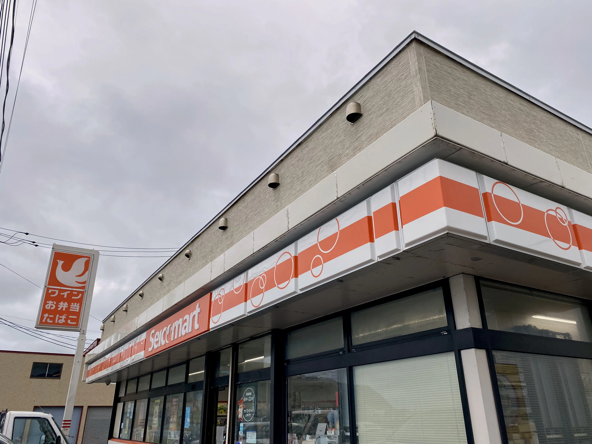

# 本土最北端 宗谷岬に行ってみた

```table-of-contents
minLevel: 2
```

## 宗谷岬とは？

宗谷岬は北海道稚内市にある本土最北端の地です。
本土というのは北海道、本州、四国、九州の4島のことだそうです。

<iframe src="https://www.google.com/maps/embed?pb=!1m18!1m12!1m3!1d22365.743085960945!2d141.91923967579638!3d45.515757420341174!2m3!1f0!2f0!3f0!3m2!1i1024!2i768!4f13.1!3m3!1m2!1s0x5f1041412dc49731%3A0xfb573b8643d8fb31!2z5a6X6LC35bKs!5e0!3m2!1sja!2sjp!4v1737196752270!5m2!1sja!2sjp" width="600" height="450" style="border:0;" allowfullscreen="" loading="lazy" referrerpolicy="no-referrer-when-downgrade"></iframe>

## アクセス

一般的なアクセスというより私が訪問した交通手段についてご紹介します。

1. なんらかの方法で稚内駅に向かう
2. 稚内駅からレンタサイクルで宗谷岬へ向かう

 2.に関しては本数が少ないもののバスが出ているのでそちらをおすすめします。
 距離にして30kmと自転車でゆったり走るにはちょうどいいぐらいではあるのですが、とんでもなく風が吹くので数字以上に大変でした。

レンタサイクルは約2,000円で借りることができ、宗谷岬で乗り捨ても可能です。
今回の訪問では宗谷岬で乗り捨てして路線バスで帰りました。

今回は稚内駅にある観光案内所で自転車を借りました。

```cardlink
url: https://www.north-hokkaido.com/spot/detail_1199.html
title: "稚内レンタサイクル｜観光スポット｜【公式】きた・北海道/稚内・利尻・礼文の観光WEBサイト"
description: "稚内観光協会では、4月下旬から10月下旬（気象状況等により変動あり）までレンタサイクルの貸出を行っています。市内の観光スポットや日本のてっぺん・宗谷岬までサイクリング等楽しみ方は色々！坂道ラクラクの電動アシストや遠乗りに最適なクロスバイク等を…"
host: www.north-hokkaido.com
favicon: https://www.north-hokkaido.com/common/images/favicon.svg
image: https://www.north-hokkaido.com/lsc/upfile/spot/0000/1199/1199_1_l.jpg
```

## レンタサイクルで宗谷岬へ

レンタサイクルを利用する際は、天候に十分注意しましょう！
なぜなら我々一行は嵐に遭ったからです。



9月下旬に訪れたのですが、売店に設置してあった温度計は13.1℃を示していました。
このあと11℃台まで下がりました。
こんな状態で全身ずぶ濡れだとどうなるか。極寒でした。


## 宗谷岬


こんな自転車で移動してきました。

到着してからはかなり晴れてきましたね。ただ風は吹いていて気温以上に寒く感じました。気温も１１度台で寒かったですが。


## バスで稚内駅に帰る

帰りに乗ったバスは観光バスも兼ねたもので、乗客は自分たち以外にはいませんでした。
運賃は普通の路線バスよりも高かったですが、宗谷丘陵に立ち寄ってくれてバスの外に出て写真撮影をする時間を作ってくれたりするので乗る価値は十分にあると思います。


すごい地形ですね。
昔は木が生い茂っていたらしいですが、山火事が相次いだことで木に遮られない絶景が見られるようになったそうです。

## リンク

ほかの日本本土四極の記事はこちらから！

- [最東端](/blog/japan-4poles-east)
- 最北端（この記事）
- [最南端](/blog/japan-4poles-south)
- [最西端](/blog/japan-4poles-west)
