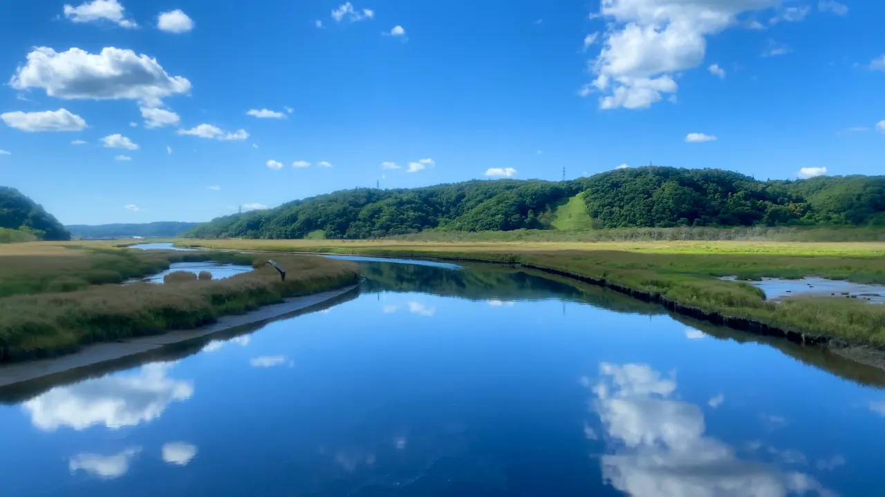
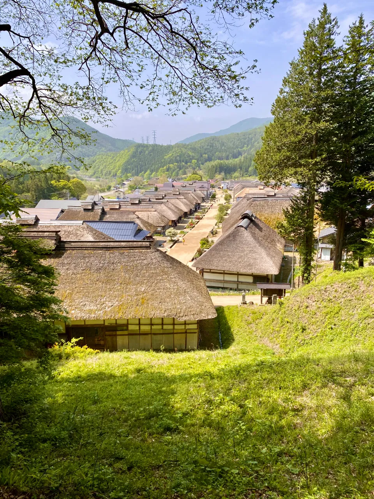

# 47都道府県を訪問した人間が紹介するおすすめ観光スポット

```table-of-contents
minLevel: 2
```

## はじめに

私は、大学生の間に47都道府県全てに訪問したというプチ自慢を持っています。
これを自己紹介などで話すことが多いのですが、そうすると必ず聞かれる質問があります。

「今まで行った中で一番良かったのはどこ？」

私はいつもこの質問に困ってしまうのです。とても一つに絞れないからです。
47都道府県それぞれの場所にそれぞれの魅力を感じているため、スコープが広くて回答しづらいのではないかと感じています。

どこもいい場所ではあったのですが、その中でもとりわけという場所を地方ごとにいくつか紹介していきます。

## 北海道

### 根室



とにかく花咲線の車窓が綺麗でした。
釧路から根室まで片道2時間半。2本のレール以外に人工物がない森や湿地の中を進む大冒険。まさしく「地球探索鉄道」でした。
一生に一度は見ておきたい景色だと思います。

## 東北

### 大内宿



福島県の会津にある旧宿場町。

## 関東

## 甲信越

## 東海

## 北陸

## 近畿

## 中国

## 四国

## 九州

## 沖縄
